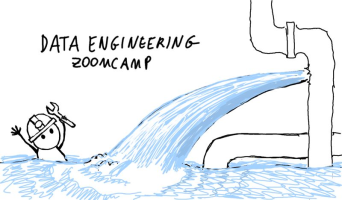
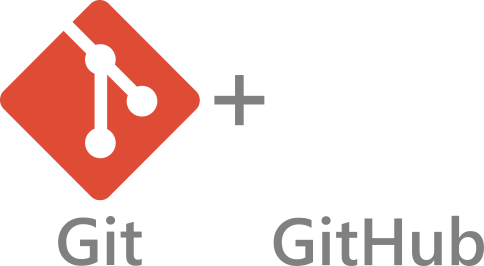
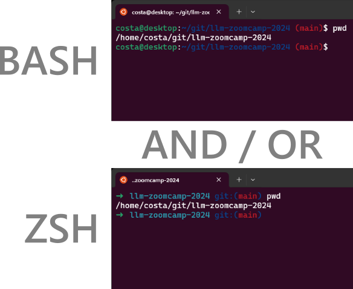
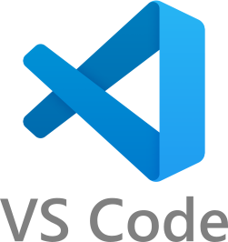
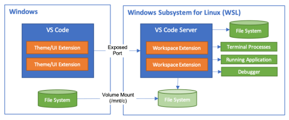
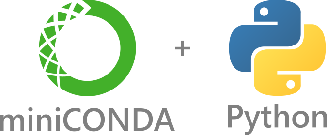
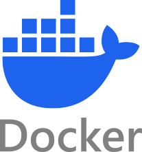

# My Dev Setup For Data & AI (2024)

👋 What's up Programmers | Devs | Engineers | Coding Enthusiasts !
- I have used this setup to finish the `Data Engineering Zoomcamp` course by `DataTalksClub`
- I am using this setup for the `LLM Zoomcamp` course by `DataTalksClub`

## Goals
- To share my current developer setup with others (**in a detailed way**)
- A beginner should be able to follow all steps (**I will post a video**)
- Make my life easier when I need to setup a new machine
- Make others' lives easier by sharing all steps
- A basic setup to learn about:
  - `Data` (`Engineering`, `Analysis`, `Science`)
  - `Artificial Intelligence (AI)`
  - `Computer Science (CS)`
  - `Software Engineering (SWE)`
  - etc.
- Should cover the basics for automation (`Python`), containerization (`Docker`), database interaction (`PostgreSQL`), Infrastructure as Code (IaC) (`Terraform`)

## DataTalksClub courses


A team of instructors sharing free data courses with the world. **Support them!**\
**This setup started based on the following course by DataTalksClub:**

### Data Engineering (DE) Zoomcamp

[**Course link**](https://github.com/DataTalksClub/data-engineering-zoomcamp)

[](https://github.com/DataTalksClub/data-engineering-zoomcamp "de_zoomcamp")

- Finished in the **Top 10** (out of 1500 students)

- Finished all homework assignments with 100%
- All solutions and answers [HERE](https://github.com/techwithcosta/de-zoomcamp-2024)

#### LinkedIn Posts
- [**Module 1:** Containerization and Infrastructure as Code](https://www.linkedin.com/posts/costadms_dezoomcamp-dataengineering-analyticsengineering-activity-7155898562508161024-cWg7?utm_source=share&utm_medium=member_desktop)
- [**Module 2:** Workflow Orchestration](https://www.linkedin.com/posts/costadms_dezoomcamp-dataengineering-analyticsengineering-activity-7159891557679038464-aevW?utm_source=share&utm_medium=member_desktop)
- [**Workshop 1:** Data Ingestion with dlt](https://www.linkedin.com/posts/costadms_dezoomcamp-dataengineering-analyticsengineering-activity-7160642685089808384-d3JT?utm_source=share&utm_medium=member_desktop)
- [**Module 3:** Data Warehouse & BigQuery](https://www.linkedin.com/posts/costadms_dezoomcamp-dataengineering-analyticsengineering-activity-7161744118996529153-OZRD?utm_source=share&utm_medium=member_desktop)
- [**Module 4:** Analytics Engineering](https://www.linkedin.com/posts/costadms_dezoomcamp-dataengineering-analyticsengineering-activity-7166111946059067392-_Jdw?utm_source=share&utm_medium=member_desktop)
- [**Module 5:** Batch Processing](https://www.linkedin.com/posts/costadms_dezoomcamp-dataengineering-bigdata-activity-7169013858496360448-RICB?utm_source=share&utm_medium=member_desktop)
- [**Workshop 2:** Stream Processing](https://www.linkedin.com/posts/costadms_dezoomcamp-dataengineering-kafka-activity-7171218183377420290--pQK?utm_source=share&utm_medium=member_desktop)
- [**Module 6:** Stream Processing](https://www.linkedin.com/posts/costadms_dezoomcamp-dataengineering-kafka-activity-7176578332061298688-tg3F?utm_source=share&utm_medium=member_desktop)
- [**Final Project:** Automating YouTube Analytics with Custom AI Integrations](https://www.linkedin.com/posts/costadms_dezoomcamp-data-tech-activity-7187469167866830848--86X?utm_source=share&utm_medium=member_desktop)
- [**Certificate**](https://www.linkedin.com/posts/costadms_dezoomcamp-data-tech-activity-7191153615980392448-6rYO?utm_source=share&utm_medium=member_desktop)

**This can be extended to the following courses:**

### Large Language Models (LLM) Zoomcamp
[**Course link**](https://github.com/DataTalksClub/llm-zoomcamp)

[](https://github.com/DataTalksClub/llm-zoomcamp "llm_zoomcamp")

### **Machine Learning (ML) Zoomcamp**
[**Course link**](https://github.com/DataTalksClub/machine-learning-zoomcamp)

[](https://github.com/DataTalksClub/machine-learning-zoomcamp "ml_zoomcamp")

### **Machine Learning Operations (MLOps) Zoomcamp**
[**Course link**](https://github.com/DataTalksClub/mlops-zoomcamp)

[](https://github.com/DataTalksClub/mlops-zoomcamp "mlops_zoomcamp")

**And other programming courses / coding projects you might be working on.**

## Summary
- **Main Operating System (OS):** Windows 11 (applicable to Windows 10)
- **Secondary OS:** Linux Ubuntu via Windows Subsystem for Linux (WSL)
- **Terminals:** BASH (with custom prompt for Git branches) + ZSH (OhMyZsh)
- **IDE:** Visual Studio Code (VS Code) (installed on Windows)
- **Version Control System:** Git + GitHub (with automated SSH-agent and passphrases)
- **Python Environment Manager:** Miniconda
- **Containerization:** Docker Desktop (installed on Windows)
- **Database:** PostgreSQL + pgcli + pgAdmin
- **Infrastructure as Code (IaC):** Terraform

## Setup Windows Subsystem for Linux (WSL)


- Additional video
- [Install Windows Subsystem for Linux (WSL)](https://www.youtube.com/watch?v=gTf32sX9ci0)\
[](https://www.youtube.com/watch?v=gTf32sX9ci0 "Install Windows Subsystem for Linux (WSL)")

### Main OS
- Windows 11
- Windows 10


### Hardware virtualization
- It should be enabled (check on `Task Manager` -> `Performance` -> `Virtualization: Enabled`)
- If it is not, I suggest enabling it on BIOS (on your CPU options enable `Intel VT-x` or `AMD-V`)
- Not sure if this is mandatory, but I always do this to ensure I can create standard virtual machines (with Virtualbox for example) it might have some performance impact on your WSL2 setup, just in case, enable it if you can

### Turn Windows features on or off
Enable both:
- Virtual Machine Platform
- Windows Subsystem for Linux

### Restart machine
Linux folder will appear on file explorer

### Install / Update WSL
- Using Command Prompt (CMD) run the following several times until the latest version is installed
```bash
wsl --update
```

### Check available Linux distros
```bash
wsl --list --online
```

### Choose and install Linux distro


```bash
wsl --install -d Ubuntu-22.04
```
- Define UNIX username
- Define password

### Uninstall distribution
- If you eventually need to uninstall a Linux distribution from WSL, go to CMD
- Get the distribution name
```bash
wsl --list
```
- Unregister the distribution, **BE CAREFUL**, everything will be deleted, backup your data if needed
```bash
wsl --unregister Ubuntu-22.04
```
- Then go to "Add or remove programs", search for the distribution name and uninstall it

### Install terminal


From Microsoft Store install the official Terminal app by Microsoft Corporation, if you do not have it yet

### Default terminal
Make Linux distro the default terminal on Terminal app settings

### Update and Upgrade Linux distro
```bash
sudo apt update
sudo apt upgrade
```

### Tip to open Windows file explorer
- From Linux terminal, run the following command to open Windows file explorer in the current Linux directory
- Useful to transfer files etc.
```bash
explorer.exe .
```

## Review Linux Commands
- Additional video
- [Basic Linux Commands for Beginners](https://www.youtube.com/watch?v=V_G2_uCE8ug)\
[](https://www.youtube.com/watch?v=V_G2_uCE8ug "Basic Linux Commands for Beginners")

## Setup Git and GitHub with SSH



- Additional videos
- [Introduction to Git and GitHub](https://www.youtube.com/watch?v=S6QcRUjpQgk)\
[](https://www.youtube.com/watch?v=S6QcRUjpQgk "Introduction to Git and GitHub")
- [Setup SSH for GitHub Workflows](https://www.youtube.com/watch?v=4dixKFaZYb4)\
[](https://www.youtube.com/watch?v=4dixKFaZYb4 "Setup SSH for GitHub Workflows")
- [Automate GitHub SSH Passphrases](https://www.youtube.com/watch?v=82YMmafbPTQ)\
[](https://www.youtube.com/watch?v=82YMmafbPTQ "Automate GitHub SSH Passphrases")
- [Basics of Git and GitHub](https://www.youtube.com/watch?v=zV0Q-gcoBA0)\
[](https://www.youtube.com/watch?v=zV0Q-gcoBA0 "Basics of Git and GitHub")

### Useful references
https://docs.github.com/en/authentication/connecting-to-github-with-ssh

### Install Git
Git should be installed by default, run the following to check
```bash
git
```
If not installed
```bash
sudo apt install git
```

### Generate SSH key
- Use same email as GitHub account
- Replace the email in the following command and run it
```bash
ssh-keygen -t ed25519 -C "techwithcosta@gmail.com"
```
- Proceed with empty filename, just press `ENTER`
- Add a passphrase that is easy to remember, you will type it often
- The `~/.ssh` folder is created
- Run the following to see it
```bash
la ~/.ssh
```

### Create GitHub account if you do not have one yet

### Add the public SSH key to GitHub account
- Check the contents of the `public` key generated in the last step
- Make sure it is the file with the `.pub` extension
```bash
cat ~/.ssh/id_ed25519.pub
```
- Copy the whole file content
- Go to GitHub account: `Settings` -> `SSH and GPG keys` -> `New SSH key`
- **Title =** *wsl* **(or other)**
- **Key type =** *Authentication Key*
- **Key =** *paste what you have copied from the last step*
- `Add SSH key`
- Enter your GitHub password if prompted
- The public SSH key has been added

### Test SSH connection to GitHub
Run the following
```bash
ssh -T git@github.com
```
- You will see a key fingerprint (if this is the first time you are trying to connect with GitHub via SSH)
- Before moving forward, copy it
- Go to https://docs.github.com/en/authentication/keeping-your-account-and-data-secure/githubs-ssh-key-fingerprints
- Confirm if it matches the respective encryption algorithm (e.g. Ed25519)
- For example:
```bash
SHA256:+DiY3wvvV6TuJJhbpZisF/zLDA0zPMSvHdkr4UvCOqU
```
- If it matches, type `yes` and hit `ENTER` to move forward
- Enter your passphrase
- You should have been successfully authenticated


### Confirm keys from known hosts
- Two files have been created inside `~/.ssh` folder `known_hosts` and `known_hosts.old`
- Run the following to check the contents of `known_hosts`
```bash
cat ~/.ssh/known_hosts
```
- Go to https://docs.github.com/en/authentication/keeping-your-account-and-data-secure/githubs-ssh-key-fingerprints
- Confirm if all fingerprints from the file match the ones from the website (should be 3)
- For example 1st:
```bash
ssh-ed25519 AAAAC3NzaC1lZDI1NTE5AAAAIOMqqnkVzrm0SdG6UOoqKLsabgH5C9okWi0dh2l9GKJl
```
- For example 2nd:
```bash
ssh-rsa AAAAB3NzaC1yc2EAAAADAQABAAABgQCj7ndNxQowgcQnjshcLrqPEiiphnt+VTTvDP6mHBL9j1aNUkY4Ue1gvwnGLVlOhGeYrnZaMgRK6+PKCUXaDbC7qtbW8gIkhL7aGCsOr/C56SJMy/BCZfxd1nWzAOxSDPgVsmerOBYfNqltV9/hWCqBywINIR+5dIg6JTJ72pcEpEjcYgXkE2YEFXV1JHnsKgbLWNlhScqb2UmyRkQyytRLtL+38TGxkxCflmO+5Z8CSSNY7GidjMIZ7Q4zMjA2n1nGrlTDkzwDCsw+wqFPGQA179cnfGWOWRVruj16z6XyvxvjJwbz0wQZ75XK5tKSb7FNyeIEs4TT4jk+S4dhPeAUC5y+bDYirYgM4GC7uEnztnZyaVWQ7B381AK4Qdrwt51ZqExKbQpTUNn+EjqoTwvqNj4kqx5QUCI0ThS/YkOxJCXmPUWZbhjpCg56i+2aB6CmK2JGhn57K5mj0MNdBXA4/WnwH6XoPWJzK5Nyu2zB3nAZp+S5hpQs+p1vN1/wsjk=
```
- For example 3rd:
```bash
ecdsa-sha2-nistp256 AAAAE2VjZHNhLXNoYTItbmlzdHAyNTYAAAAIbmlzdHAyNTYAAABBBEmKSENjQEezOmxkZMy7opKgwFB9nkt5YRrYMjNuG5N87uRgg6CLrbo5wAdT/y6v0mKV0U2w0WZ2YB/++Tpockg=
```
- If everything matches perfectly, move forward

### Remove old known hosts file
```bash
rm ~/.ssh/known_hosts.old
```

### Configure Git with your identity
- Run the following to specify who is going to sign your commits with an user name and email
- I use my first and surnames and the same email address as the GitHub account
- Replace with yours
```bash
git config --global user.name "Diogo Costa"
git config --global user.email techwithcosta@gmail.com
```
- The `~/.gitconfig` is created
- Run the following to confirm your identity has been added
```bash
cat ~/.gitconfig
```

### Create folder for projects on user's home directory
- This folder will contain all your projects, name it `git`, `projects`, `code` or whatever
- I call mine `git`
```bash
mkdir ~/git
```

### Clone original course repo
- From this point forward, the process applies to pretty much any coding project you might be following, or creating yourself
- I will exemplify it using the `LLM Zoomcamp` course by `DataTalksClub`
- Run something similar to the following to clone the original course repository into the `git` folder
- If your folder has a different name than `git`, replace it, get the SSH address from the target GitHub repo
```bash
cd ~/git
git clone git@github.com:DataTalksClub/llm-zoomcamp.git
```
- Enter your passphrase (we will automate this further ahead)
- I do this to have easy local access to the course materials
- I just run the following each time I start working, to ensure my local branch is up to date
```bash
cd ~/git/llm-zoomcamp
git fetch
git pull
```

### Create and clone your course repo
- Go to your GitHub account
- `Repositories` -> `New`
- **Repository name =** *llm-zoomcamp-2024* **(or other)**
- **Description =** *Course walkthrough: Large Language Models Zoomcamp 2024 (by DataTalksClub).* **(or other)**
- **Public**, to share the repo with everyone, course community, for homework submission and portfolio
- **Initialize this repository with: =** Enable *Add a README file*
- `Create repository`
- Clone the repository by running something similar to the following, replace with yours
```bash
cd ~/git
git clone git@github.com:techwithcosta/llm-zoomcamp-2024.git
```
- Enter your passphrase (we will automate this further ahead)

### Git + GitHub workflow examples
- Additional videos
- [GitHub Workflow Examples (Part 1)](https://www.youtube.com/watch?v=67opvHhjkME)\
[](https://www.youtube.com/watch?v=67opvHhjkME "GitHub Workflow Examples (Part 1)")
- [GitHub Workflow Examples (Part 2)](https://www.youtube.com/watch?v=m0Rc9YbunNw)\
[](https://www.youtube.com/watch?v=m0Rc9YbunNw "GitHub Workflow Examples (Part 2)")

## Setup Linux Terminals



- Additional videos
- [Awesome BASH Trick (For Git Users)](https://www.youtube.com/watch?v=BdNcLYaU7wI)\
[](https://www.youtube.com/watch?v=BdNcLYaU7wI "Awesome BASH Trick (For Git Users)")
- [Improve Your Terminal (Easy Way)](https://www.youtube.com/watch?v=J-L2huPs9EM)\
[](https://www.youtube.com/watch?v=J-L2huPs9EM "Improve Your Terminal (Easy Way)")

### Backup `.bashrc` file
Just in case we mess something up
```bash
cp ~/.bashrc ~/.bashrc.bak
```

### Customize BASH prompt for Git
- Let's customize the BASH prompt to include the Git branch name on it, each time we are in a `.git` folder
- Run the following to edit the file
```bash
nano ~/.bashrc
```
- Use the `DOWN ARROW` or `PAGE DOWN` key to find the following rows
```bash
if [ "$color_prompt" = yes ]; then
    PS1='${debian_chroot:+($debian_chroot)}\[\033[01;32m\]\u@\h\[\033[00m\]:\[\033[01;34m\]\w\[\033[00m\]\$ '
else
    PS1='${debian_chroot:+($debian_chroot)}\u@\h:\w\$ '
fi
```
- Delete them by pressing `CTRL + K` after positioning the cursor on each of them, using the keyboard arrows
- **NOTE:** Do not delete the following row
```bash
unset color_prompt force_color_prompt
```
- Add the following rows to replace them
```bash
# Add git branch to prompt
parse_git_branch() {
    git rev-parse --is-inside-work-tree >/dev/null 2>&1 || return
    git branch 2> /dev/null | sed -e '/^[^*]/d' -e 's/* \(.*\)/(\1)/' | sed 's/^/ /'
}
if [ "$color_prompt" = yes ]; then
 PS1='${debian_chroot:+($debian_chroot)}\[\033[01;32m\]\u@\h\[\033[00m\]:\[\033[01;34m\]\w\[\033[01;31m\]$(parse_git_branch)\[\033[00m\]\$ '
else
 PS1='${debian_chroot:+($debian_chroot)}\u@\h:\w$(parse_git_branch)\$ '
fi
```
- Save the file by pressing `CTRL + X`, then hit `Y` and then `ENTER`
- The `PS1` variable defines what appears in the terminal prompt, using ANSI codes for colors, etc.
- We use the function `parse_git_branch` and a regular expression to get the activated branch whenever we are in a `.git` folder
- Concatenation is used to include the branch name into the prompt
- This is super useful for Git + GitHub workflows, if you prefer BASH
- I mostly use ZSH, which has a lot of customization frameworks with themes, colors, extra functionalities, such as:
  - `OhMyZsh`
  - `OhMyPosh`
  - `Powerlevel10k`
  - `Starship`
  - etc.

### Refresh BASH
Open a new BASH window for the changes to take effect

### Check Git branch name on BASH prompt
To validate this, go to a Git repository such as
```bash
cd ~/git/llm-zoomcamp
```
Verify that the selected branch appears in the prompt automatically, most likely the `main` branch

### Delete `.bashrc` backup
If everything went well, delete the backup file (or not)
```bash
rm ~/.bashrc.bak
```

### Install zsh
```bash
sudo apt install zsh
```

### Install OhMyZsh
```bash
sh -c "$(wget -O- https://raw.githubusercontent.com/ohmyzsh/ohmyzsh/master/tools/install.sh)"
```
I like to have ZSH as my default shell, so I choose `Y` when prompted

### Automate SSH-Agent passphrases for both BASH and ZSH

- Append the following code to the bottom of both `.bashrc` and `.zshrc` files
- This way you only have to enter your passphrase once, per terminal, per computer start up
```bash
# Auto-lauching ssh-agent
env=~/.ssh/agent.env

agent_load_env () { test -f "$env" && . "$env" >| /dev/null ; }

agent_start () {
    (umask 077; ssh-agent >| "$env")
    . "$env" >| /dev/null ; }

agent_load_env

# agent_run_state: 0=agent running w/ key; 1=agent w/o key; 2=agent not running
agent_run_state=$(ssh-add -l >| /dev/null 2>&1; echo $?)

if [ ! "$SSH_AUTH_SOCK" ] || [ $agent_run_state = 2 ]; then
    agent_start
    ssh-add
elif [ "$SSH_AUTH_SOCK" ] && [ $agent_run_state = 1 ]; then
    ssh-add
fi

unset env
```
Use the following commands
```bash
nano ~/.bashrc
```
```bash
nano ~/.zshrc
```
- Open multiple BASH and ZSH windows to validate
- Test SSH connection to GitHub
```bash
ssh -T git@github.com
```

## Setup VS Code With WSL (IDE)



### Download Visual Studio Code (VS Code)
https://code.visualstudio.com/download

### Install VS Code
- Activate all ticks except desktop icon
- Pin to taskbar

### Follow the welcome steps if you want and read docs to learn more about VS Code functionalities
- https://code.visualstudio.com/docs
- https://code.visualstudio.com/docs/remote/wsl
- https://code.visualstudio.com/docs/terminal/basics
- https://code.visualstudio.com/docs/python/python-quick-start
- https://code.visualstudio.com/docs/containers/overview
- Explore WSL, Git + GitHub setup, Python, Docker etc.



### Install WSL extension
- It should pop up automatically after running VS Code for the first time
- If not, go to extensions panel and find it: `WSL` by Microsoft

### Open VS Code from WSL
- Close VS Code
- Go to a project folder on Linux terminal
- Execute the following from that folder
```bash
code .
```
- Or
```bash
code ~/git/llm-zoomcamp
```
- A remote connection to Linux distribution will be created after the automatic setup of VS Code Server
- We will work on VS Code installed on Windows, with automatic remote connections to Ubuntu, through WSL2, leveraging both OSs
- Trust the authors if prompted

### Check `WSL` tab
- On bottom left corner, find the WSL tab, left click to see several options
- Since we have launched WSL directly from the folder on Ubuntu with `code` command, the remote connection is established automatically
- We do not need to do anything else here
- Close the welcome page

### Time to explore VS Code (optional)
### Check `Explorer` panel
Here you can find all files and folders that exist within the directory you are currently working at

### Open a file
- Open the `README.md`, one click opens a temporary tab, two clicks open a fixed tab
- Press `CTRL + SHIFT + P`, select `Markdown: Open Preview to the Size`
- You can achieve the same thing with `CTRL + K` (notice the message in the bottom tab) and then `V`
- Now you see the markdown code on the left, and the rendered result on the right, the scroll is synchronized

### Check `Search` panel
Enables you to search through all folders and files, even with regular expressions

### Check `Run and Debug` panel
Super useful functionality, to debug any type of code in an interactive way

### Check `Extensions` panel
- Install `Code Spell Checker` by Street Side Software, for spelling suggestions
- Write something wrong, then `right click` -> `Spelling Suggestions...`
- Install `Todo Tree` by Gruntfuggly
- Write "TODO" as a coding language comment to group all your TODOs in the `TODOs` panel
- There are a ton of extensions to explore, for pretty much everything you can imagine

### Check `Remote Explorer` panel
- Shows the WSL targets, in this case Ubuntu, where we are connected to

### Open new terminal
- `Terminal` -> `New Terminal`
- Or with shortcut, on my Portuguese keyboard is `CTRL + SHIFT + ç` (cedilla)
- `CTRL + ç` closes and opens the current terminal
- All shortcuts are customizable on `File` -> `Preferences` -> `Keyboard Shortcuts`
- By default ZSH opens
- Can open multiple terminals, BASH, etc.
- Even multiplexers such as Tmux, to split one terminal windows into many more
- This provides direct interaction with the WSL distribution directly from within VS Code

### Check `Git + GitHub` tab
- On bottom left corner, we have direct access to branches options
- We can create and switch between branches, and the repository updates automatically in the `Explorer` panel
- Search for Git on `CTRL + SHIFT + P` to see options
- You can choose to interact with Git via UI, or via integrated terminals in the bottom

### Check `Source Control` panel
- To follow this, switch to your course repository
```bash
code ~/git/llm-zoomcamp-2024 
```
- Since the current work folder is also a Git repository, the Source Control panel will show file changes and enable you to add, commit and push changes directly to the remote repository
- It even shows the differences for edited files, line by line
- Open a ZSH within VS Code with `CTRL + ç`
- Edit the `README.md` file
- Notice the white circle on the tab name, showing that the file has been edited but not saved
- Save the file with `CTRL + S`
- Notice the yellow names on tab and `Explorer` panel, and the `M` in front of the filename, standing for `Modified`
- Open `Source Control` panel and see that `README.md` file has been changed
- Click on it
- Green shows a new added line, red would be removed, etc.
- Click on `+` to stage changes
- Write a commit message
- `Commit`
- `Sync Changes` to push to remote repository, `OK`
- Check repo on GitHub to see change
- `Would you like Visual Studio Code to periodically run "git fetch"?` I like to fetch and pull the code manually, so I hit `No`
- Can do this via terminal `git fetch` and `git pull` or on bottom left corner with "cycle" symbol
- Edit `README.md` file again, refresh terminal, check yellow cross on OhMyZsh prompt, indicating there are changes
- Discard changes on `Source Control` panel, refresh terminal, yellow cross on OhMyZsh prompt should disappear

## Setup VS Code For Python on WSL With Miniconda



### Install latest version of Miniconda
- Run the following to install Miniconda
```bash
mkdir -p ~/miniconda3
wget https://repo.anaconda.com/miniconda/Miniconda3-latest-Linux-x86_64.sh -O ~/miniconda3/miniconda.sh
bash ~/miniconda3/miniconda.sh -b -u -p ~/miniconda3
rm -rf ~/miniconda3/miniconda.sh
~/miniconda3/bin/conda init bash
~/miniconda3/bin/conda init zsh
```
- Refresh terminal
- Miniconda files will be stored on the `~/miniconda3` folder, containing the `envs` we create in the future

### Default env activation
- `(base)` appears now behind the prompt, indicating that the "base" conda env is activated
- I do not like this, so to prevent conda from activating the base env by default run the following
```bash
conda config --set auto_activate_base false
```
- Refresh the terminal, it does not activate anymore

### Interact with conda environments
- Create new conda env for project named `llm-zoomcamp-2024-env` and install specific Python version automatically
```bash
conda create -n llm-zoomcamp-2024-env python=3.10
```
- `-n` is the simplification of `--name`
- I like to use the project folder name + `-env` in the end
- Change the project name and/or Python version if needed
- Activate conda env, its name will appear behind the prompt
```bash
conda activate llm-zoomcamp-2024-env
```
- List envs (if one is activated, will show asterisk on it)
```bash
conda env list
```
- Deactivate the current env, its name will disappear behind the prompt
```bash
conda deactivate
```
- Delete conda env
```bash
conda remove -n llm-zoomcamp-2024-env --all
```
- List envs, it is removed
```bash
conda env list
```
- We can create the same env by avoiding typing the env name, from the target project folder
```bash
conda create -n "$(basename $(pwd)-env)" python=3.10
```
- Check automatic folder name retrieval
```bash
echo "$(basename $(pwd)-env)"
```
- If you omit `python=3.10`, a new env will be created without Python and you would need to install it manually, after its activation
```bash
conda create --name llm-zoomcamp-2024-env
```
- Activate conda env
```bash
conda activate llm-zoomcamp-2024-env
```
- Run Python, without success
```bash
python
```
- Install Python manually in the activated env
```bash
conda install python=3.10
```
- Run Python, with success
```bash
python
```
- Type `exit()` to exit the interpreter

### Open project on VS Code
Open VS Code from project folder by running
```bash
code ~/git/llm-zoomcamp-2024
```

### Create Python file
```bash
code script.py
```
- Save the file

### Install extension
`Python` by Microsoft, should be prompted automatically

### Associate correct Python interpreter on VS Code
- Click the Python interpreter tab on bottom right corner or `CTRL + SHIFT + P` and select `Python: Select Interpreter`
- Choose the env you have just created
- Refresh terminals inside VS Code
- From now on, whenever you open the project with VS Code, this conda env will be activated in the terminal, and the interpreter correctly selected
- Whenever we install packages via the terminal, ensuring the correct env is activated, the packages will be isolated into it, avoiding corruption of other projects
- Restart VS Code and validate activated env + selected interpreter
- You might need to do this a couple of times to save the setup

### Python manager workflow
- For each project inside the `git` folder that require Python, I create a specific conda env to ensure package isolation
- Then I associate each VS Code instance to each project / conda env / interpreter

### Python interaction options
- Script
- Jupyter cells
- Jupyter notebook on browser with server
#### Script
- Add the following to `script.py`
```python
# this is a comment
print('hello world')

# this is another comment
x = 2
y = 5
print(x * y)
```
- Execute the whole script using UI "play" symbol on top right corner, this will use the current activated conda env interpreter
- Or via terminal
```bash
python script.py
```
- Check the outputs on terminal

#### Jupyter cells
- Sometimes I want to run sections of my code independently, similarly to how you might work in a Jupyter Notebook, this is useful for debugging purposes during development, more flexible
- Duplicate `script.py` and call it `cells.py` (`LEFT CLICK` + `DRAG` + `CTRL` on `Explorer` panel)
- Install extension `Jupyter` by Microsoft
- Separate code in cells or section with `#%%` tags
- To execute one cell, use the UI
- The interactive window will appear
- Install `ipykernel` package in the activated conda env
- We can also execute cell via keyboard shortcut (I use this all the time)
- `CTRL + ENTER`, to run the current cell and stay within the same cell
- `SHIFT + ENTER`, to run the current cell and move to the next cell below
- Check the outputs from each cell in the interactive window straight away
- Check Jupyter tab with variables from current session
- Change variables and see them updating
- The interactive window can be refreshed by `Clear All`
- `Restart` will restart the kernel, sometimes useful to reset all variables or due to bugs
- Kernel can also be changed
- Run all cells again
- Save the file as `cells.ipynb`, as a classic Jupyter notebook
- Open it to run it
- Select an interpreter
- We can interact with it similarly to the conventional Jupyter notebooks on browser

#### Jupyter notebook on browser with server
- If you really want to run a Jupyter notebook on browser with a server, do the following
- With the proper conda env activated, install Jupyter package
```bash
pip install jupyter
```
- Initialize Jupyter server
```bash
jupyter notebook
```
- The current terminal will be dedicated to it
- A port will be forward automatically and associated to the server
- Open in browser
- Copy token after running the following in a new terminal (after `?token=`)
```bash
jupyter server list
```
- Paste token on browser
- Enter a new password
- "Log in and set new password"
- Open the notebook from the explorer
- Change stuff and run
- Save the notebook
- Back in VS Code the same changes will appear

## Download and install Docker Desktop on Windows



- Run the following and confirm that Docker is not accessible
```bash
docker
```
- "Download for Windows" from https://www.docker.com/products/docker-desktop/
- Start installation
- If your Windows version is not `Home`, and instead is `Enterprise` or other, you might see an additional tick box during setup, if so, do use `WSL2 instead of Hyper-V`
- Run Docker Desktop after installation
- Accept "Docker Subscription Service Agreement"
- Sign up and / or sign in
- Open Docker Desktop
- Skip survey, or not
- Check for updates on bottom right corner
- Download update, if any exists
- "Update and restart" to update Docker Desktop
- Check green "Engine running" message on bottom left corner
- Pin Docker to taskbar
- Save your stuff and restart your Windows machine
- Run Docker Desktop
- You can always check if Docker is running in the Windows system tray icon (bottom right corner)
- Go to `Settings` -> `General` and check if "Use the WSL 2 based engine" is ticked, because "WSL 2 provides better performance than the Hyper-V backend"
- Go to `Settings` -> `Resources` -> `WSL Integration`: check if "Enable integration with my default WSL distro" is ticked and enable your distro "Ubuntu-22.04"
- `Apply & restart`
- `Cancel`
- Now the following command should output something on your Linux terminal
```bash
docker
```
- Run your first test container
```bash
docker run hello-world
```
- If you get an error similar to the following
```bash
docker: Error response from daemon: Head "https://registry-1.docker.io/v2/docker/welcome-to-docker/manifests/latest": unauthorized: incorrect username or password.
```
- Log out from Docker and login again **via terminal**, replacing your username or email
```bash
docker logout
docker login --username techwithcosta@gmail.com
```
- Enter password, "Login Succeeded"
- Run your first test container
```bash
docker run hello-world
```
- The image should be fetched from the server and the container will run, showing the test message output "Hello from Docker!"
- Open Docker Desktop and see the container with a random name and its image
- Run another test container
```bash
docker run -d -p 8080:80 docker/welcome-to-docker
```
- Open browser and go to http://localhost:8080/
- You can also run an Ubuntu container (run `exit` to quit)
```bash
docker run -it ubuntu
```
- Or even a Python container (run `exit()` to quit)
```bash
docker run -it python:3.10
```
- Stop all containers and delete all containers and images via UI (could be done via terminal)

## Setup Docker with PostgreSQL (database)


### Define containers
- Create `docker-compose.yaml` file
- Add the following content
- Save the file
```yaml
services:
  pgdatabase:
    image: postgres:13
    environment:
      - POSTGRES_USER=root
      - POSTGRES_PASSWORD=root
      - POSTGRES_DB=my_test_db
    volumes:
      - "./my_test_db_postgres_data:/var/lib/postgresql/data"
    ports:
      - "5432:5432"
  pgadmin:
    image: dpage/pgadmin4
    environment:
      - PGADMIN_DEFAULT_EMAIL=admin@admin.com
      - PGADMIN_DEFAULT_PASSWORD=root
    volumes:
      - pgadmin_data:/var/lib/pgadmin/data
    ports:
      - "8080:80"
volumes:
  pgadmin_data:
```
---
- This file defines two Docker containers or "services"
#### pgdatabase
- **image**: Uses the PostgreSQL version 13 image.
- **environment**:
  - `POSTGRES_USER=root`: Sets the PostgreSQL username to "root".
  - `POSTGRES_PASSWORD=root`: Sets the PostgreSQL password to "root".
  - `POSTGRES_DB=my_test_db`: Creates a database named "my_test_db".
- **volumes**:
  - `./my_test_db_postgres_data:/var/lib/postgresql/data`: Maps the local directory `my_test_db_postgres_data` to the PostgreSQL data directory to persist data.
- **ports**:
  - `5432:5432`: Exposes PostgreSQL on port 5432.
#### pgadmin
- **image**: Uses the pgAdmin 4 image.
- **environment**:
  - `PGADMIN_DEFAULT_EMAIL=admin@admin.com`: Sets the default admin email for pgAdmin.
  - `PGADMIN_DEFAULT_PASSWORD=root`: Sets the default admin password for pgAdmin.
- **volumes**:
  - `pgadmin_data:/var/lib/pgadmin/data`: Uses a Docker volume named `pgadmin_data` to persist pgAdmin data.
- **ports**:
  - `8080:80`: Exposes pgAdmin on port 8080 of the host.
- And one volume `pgadmin_data`, to store pgAdmin data
---
- Make sure all containers are stopped to free up all ports
- From the same folder where the `docker-compose.yaml` is stored, run the following
```bash
docker compose up
```
- After pulling both images, the containers should run
- The terminal will be dedicated to these containers
- Install extension on VS Code: `Docker` by Microsoft
- You can see and interact with containers from VS Code directly (`Docker` panel)
- Check Docker containers that are running via terminal
```bash
docker ps
```
- Check Docker networks via terminal
```bash
docker network ls
```

### Setup `pgcli`
- `pgcli` is a Python package, useful to interact with PostgreSQL DBs via terminal
- Install pgcli dependencies (for reference https://www.pgcli.com/install)
```bash
sudo apt-get install libpq-dev
```
- From a new terminal, install `pgcli`, with the correct conda env activated
```bash
pip install pgcli
```

### Connect to PostgreSQL via pgcli
- Access the PostgreSQL DB on Docker container, use the credentials from Docker compose file
  - -h is host
  - -p is port
  - -u is user
  - -d is DB name
```bash
pgcli -h localhost -p 5432 -u root -d my_test_db
```
- Enter password `root`
- Check empty list of tables inside DB
```bash
\dt
```
- Test SQL with the following command
```bash
SELECT 1 AS hello_world;
```
- Quit from `pgcli` by running `quit`

### Connect to PostgreSQL via pgAdmin
- Both containers have to be connected to the same network in order for pdAdmin to connect to PostgreSQL DB
- Go to browser and http://localhost:8080/
- pgAdmin should open, if the previous container output still shows up, clear your browser's cookies / history by pressing `CTRL + SHIFT + DEL`, or open it in a private browser tab
- Login using credentials from Docker compose file `admin@admin.com` and `root`
- On pdAdmin go to `Object` -> `Register` -> `Server`
- Give it a name "test_pg"
- Go to Connection tab "Host name/address" should be "pgdatabase" or "host.docker.internal"
- Port is 5432
- Username is "root"
- Password is "root"

### Create sample table via pgAdmin
- Create sample table
- Open query tool and run the following (for reference https://www.w3schools.com/postgresql/postgresql_create_table.php)
```sql
CREATE TABLE cars (
  brand VARCHAR(255),
  model VARCHAR(255),
  year INT
);
```
- Populate table with sample data (for reference https://www.w3schools.com/postgresql/postgresql_insert_into.php)
```sql
INSERT INTO cars (brand, model, year)
VALUES
  ('Volvo', 'p1800', 1968),
  ('BMW', 'M1', 1978),
  ('Toyota', 'Celica', 1975);
```
- Expand `test_pg` -> `Databases` -> `my_test_db` -> `Schemas` -> `public` -> `Tables` -> `cars` -> `right click` -> `View/Edit Data` -> `All Rows`

### Access same test table via pgcli
- On pgcli run `\dt` and see new table
- Run the following SQL queries to explore the data
- Use `q` to quit the query results view after each query
```sql
SELECT * FROM cars;
```
```sql
SELECT * FROM cars ORDER BY year;
```
```sql
SELECT * FROM cars WHERE year > 1975;
```

## Install Terraform Infrastructure as Code (IaC)


- For reference https://developer.hashicorp.com/terraform/tutorials/aws-get-started/install-cli
- Ensure that your system is up to date and you have installed the `gnupg`, `software-properties-common`, and `curl` packages installed. You will use these packages to verify HashiCorp's GPG signature and install HashiCorp's Debian package repository
```bash
sudo apt-get update && sudo apt-get install -y gnupg software-properties-common
```
- Install the HashiCorp GPG key
```bash
wget -O- https://apt.releases.hashicorp.com/gpg | \
gpg --dearmor | \
sudo tee /usr/share/keyrings/hashicorp-archive-keyring.gpg > /dev/null
```
- Verify the key's fingerprint
```bash
gpg --no-default-keyring \
--keyring /usr/share/keyrings/hashicorp-archive-keyring.gpg \
--fingerprint
```
- The gpg command will report the key fingerprint. Confirm fingerprint here https://www.hashicorp.com/trust/security?product_intent=terraform
- In the browser, search using `CTRL + F` and paste the string to compare
- An extra space should appear in the middle of the string, remove it to ensure match
- If it matches, proceed
- Add the official HashiCorp repository to your system. The `lsb_release -cs` command finds the distribution release codename for your current system, such as `buster`, `groovy`, or `sid`
```bash
echo "deb [signed-by=/usr/share/keyrings/hashicorp-archive-keyring.gpg] \
https://apt.releases.hashicorp.com $(lsb_release -cs) main" | \
sudo tee /etc/apt/sources.list.d/hashicorp.list
```
- Download the package information from HashiCorp
```bash
sudo apt update
```
- Install Terraform from the new repository
```bash
sudo apt-get install terraform
```
- Verify installation
```bash
terraform
```
- Install the autocomplete package
```bash
terraform -install-autocomplete
```
- Create a directory named `learn-terraform-docker-container` for testing purposes
```bash
mkdir learn-terraform-docker-container
```
- This working directory stores the configuration files that you write to describe the infrastructure you want Terraform to create and manage. When you initialize and apply the configuration here, Terraform uses this directory to store required plugins, modules (pre-written configurations), and information about the real infrastructure it created
- Navigate into the working directory
```bash
cd learn-terraform-docker-container
```
- In the working directory, create a file called `main.tf`
```bash
code main.tf
```
- Paste the following Terraform configuration into it, which is just an example to interact with Google Cloud Platform (GCP), to create a storage bucket and BigQuery dataset
- I have used something similar during the `Data Engineering Zoomcamp` course by `DataTalksClub`
```terraform
terraform {
  required_providers {
    google = {
      source  = "hashicorp/google"
      version = "5.13.0"
    }
  }
}

provider "google" {
  credentials = "./keys/my-credentials.json"
  project     = "terraform-demo-412110"
  region      = "europe-southwest1"
}

resource "google_storage_bucket" "data-lake-bucket" {
  name          = "terraform-demo-412110-terra-bucket"
  location      = "EU"
  force_destroy = true

  # Optional, but recommended settings:
  storage_class               = "STANDARD"
  uniform_bucket_level_access = true

  versioning {
    enabled = true
  }

  lifecycle_rule {
    action {
      type = "Delete"
    }
    condition {
      age = 30 // days
    }
  }
}

resource "google_bigquery_dataset" "dataset" {
  dataset_id = "demo_dataset"
  project    = "terraform-demo-412110"
  location   = "EU"
}
```
- Save the file
- Install extension on VS Code: `HashiCorp Terraform` by HashiCorp
- Now the file gets highlighted
- Initialize the project, which gets provider plugins that lets Terraform interact with GCP
```bash
terraform init
```
- Two hidden folders should get created: `.terraform` and `.terraform.lock.hcl`
- In a real scenario, you would setup your GCP service account credentials (in this example, here "./keys/my-credentials.json")
- From this point on you could run the following
```bash
terraform plan
```
```bash
terraform apply
```
```bash
terraform destroy
```

## Improvements
- **Setup automation:** shell scripting, devcontainer (Docker), etc.
- TBD

## Support TechWithCosta @ YouTube (or not)
[TechWithCosta](https://www.youtube.com/@TechWithCosta)\
[](https://www.youtube.com/@TechWithCosta "TechWithCosta")

## Good luck
